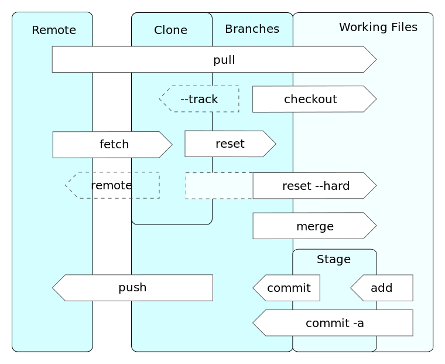

Linux
=====

.. image:: images/linus.jpg
   :width: 22%
   :align: left

.. image:: images/linux.png
   :width: 26%
   :align: left

1991 begann Linus Torvalds in Helsinki (Finnland) mit der Entwicklung von Linux, um unter anderem seinen eigenen Computer besser zu verstehen. Mit der Zeit merkte er, dass sich das System immer mehr zu einem Betriebssystem entwickelte. Heute ist Linux ein modular aufgebautes Betriebssystem und wird von Softwareentwicklern auf der ganzen Welt weiterentwickelt.

.. note:: *Modulares Betriebssystem* bedeutet, dass das Betriebssystem des Computers aus einzelnen Bausteinen (Modulen) besteht. Stell dir einfach vor, du würdest dir verschiedene Lego-Steine aussuchen und zusammenstecken - genau so machst du es mit Modulen, um dein perfektes Betriebssystem zu generieren.

Linux wird fast überall eingesetzt, beispielsweise auf Smartphones, Notebooks, Multimedia-Endgeräten und Supercomputern.
Dies bringt auch zahlreiche Nutzer mit sich, darunter private Personen (wie du und ich), Regierungen, Organisationen und Unternehmen.

Git
===

Git ist eine freie Software - also gratis - und wird dir helfen, deine Dateien zu verwalten. Auch dieses Tool hat Linus Torvalds ins Leben gerufen - es lohnt sich also, diesen Mann zu kennen |twinker|.

GitHub
------

GitHub ist ein Onlinedienst, der unsere Entwicklungsprojekte auf seinen Servern speichert und pflegt (File-hosting). Die Firma GitHub, Inc. hat ihren Sitz in San Francisco in Amerika! Jedesmal, wenn du also Änderungen an deiner Page machst, geschehen diese Änderungen in San Francisco auf einem Computer, werden dort gespeichert und reisen den ganzen Weg über den Atlantik zurück auf deinen Bildschirm!

.. image:: images/sf.png
   :width: 700 px

GitHub war im Jahr 2011 bei Open-Source-Software der berühmteste Dienst seiner Art. Er hat über 31 Millionen (31'000'000) registrierte Nutzer und verwaltet 96 Millionen (96'000'000) Repositories (Stand: Oktober 2018) - du gehörst seit heute auch dazu!

.. image:: images/github.png
   :width: 45%
   :align: left

.. image:: images/walter.jpg
   :width: 25%
.. image:: images/spider.png
   :width: 25%

.. todo:: |exercise| Wie siehst du aus im Git-Universum? Suche dir `hier`_ eine Verkleidung aus! |smile|

Ein Repository laden
""""""""""""""""""""

Es gibt typischerweise zwei Möglichkeiten ein GitHub Repository zu erhalten:

 #. Man nimmt einen lokalen Ordner und verwandelt diesen in ein GitHub Repository
 #. Man *klont* ein bestehendes Repository von GitHub

In beiden Fällen erhält man sein Repository lokal verfügbar auf seiner eigenen Festplatte.

.. note:: *Repository* ist das englische Wort für 'Lager'.

   Du kannst dir ein Repository als digitale Lagerhalle vorstellen, in der du alle deine Ordner und Hefte deponierst.  Wenn du Änderungen machen möchtest, holst du den entsprechenden Ordner aus dem Lager (check-out) und bringst ihn nach getaner Arbeit wieder dorthin zurück (check-in).

Klonen eines Repositories
^^^^^^^^^^^^^^^^^^^^^^^^^

Um ein Repository zu klonen brauchst du den Befehl ``git clone <url>``. Statt nur einer einfachen Kopie der Dateien kriegst du mit diesem Befehl alle Versionen, Daten und Dateien, die auf dem Server vorhanden sind.

.. code-block:: bash

   $ git clone https://github.com/user/repository.git

.. todo:: |exercise| Findest du heraus, wie dein Befehl genau lauten muss? Schreib ihn dir auf - du wirst ihn bald brauchen..

Änderungen hochladen
^^^^^^^^^^^^^^^^^^^^

Nachdem du deinen Inhalt und Dateien geändert hast, muss du die Änderungen entsprechend auch an GitHub senden. Tust du das nicht, findest du auf deiner Homepage immer noch die alten Inhalte. Upload funktioniert über folgende Befehlsfolge:

 #. Speichere deine Files im richtigen Ordner auf deinem Computer
 #. ``git status`` zeigt dir an, welche Dateien noch hinzugefügt werden müssen (|rot|) und welche bereits im stage warten (|grün|)
 #. ``git add .``
 #. ``git commit -m "Beschreibe was bei diesem upload passiert"``
 #. ``git push``

Wenn du eine Datei im stage hast, die dort nicht hin gehört, kannst du diese auch wieder entfernen bevor das ganze Paket an GitHub gesendet wird. Dies tust du wie folgt:

 #. ``git reset HEAD deine_datei``

Synchronisieren
^^^^^^^^^^^^^^^

Um alle neuen Dateien zu downloaden und Änderungen zu erhalten, gib den folgenden Befehl ein

.. code-block:: bash

   $ git pull

Übersicht Git Stationen
^^^^^^^^^^^^^^^^^^^^^^^

.. note:: *Remote* ist das englische Wort für 'entfernt' oder 'Fernbedienung'.

   Stelle dir vor du änderst den Fernseh-Sender vom Sofa aus, dann wird das Umschalten *remote* von dir gesteuert. Sprich: du musst nicht aufstehen und zum Fernseher gehen.

   Das Gleiche machst du, wenn du die Dateien auf deinem Computer änderst und diese Änderungen auf dem GitHub Server in Amerika speicherst.

Python
======

.. image:: images/python.png
   :width: 190 px
   :align: left

Python ist einer der beliebtesten Programmiersprachen der Welt und - wie du merken wirst - ganz einfach zu lernen! Heute wirst du in dieser Sprache eine eigene Webseite erstellen und darauf kuriose Programme laufen lassen!

Die mächtige Bibliothek ist eine der grössten Stärken von Python. Wie in der Bücher-Bibliothek kannst du in der Python-Bibliothek stöbern und dir gewisse Pakete ausleihen, die von anderen Leuten verpackt wurden. Diese Pakete unterhalten dich, helfen dir Aufgaben zu lösen oder zeigen die neue Möglichkeiten.

Bevor du also etwas selber programmierst, gehe **immer** zuerst in die Bibliothek und schau dich um, ob es schon etwas passendes gibt! |books|

.. note:: Python ist so gut, dass es für viele interessante Aufgaben in der Medizin oder Naturwissenschaften verwendet wird. Man kann mit Python sogar die Lampen und die Heizung im Haus steuern!

   Sogar Teile der Suchmaschine Google sind in Python geschrieben und auch für YouTube wurde Python verwendet.

Sphinx
------

Wer - wie du heute - selbst an einem Projekt arbeitet, kennt das Problem, dass man später einmal vergisst, was man eigentlich gemacht hat. Dafür muss man Dokumentationen schreiben! ..und das machen wir mit Sphinx. Sphinx ist ein in Python geschriebens Tool (Hilfsmittel) und soll helfen, Python Projekte zu dokumentieren.

Sphinx ist sehr leich anzuwenden, denn es verwendet reStructuredTest (reST) als Sprache. Mit reST kannst du auch in der Rohform leicht lesen und schreiben. Zum Beispiel kannst du verschiedene Textelemente einfach kennzeichnen:

.. code-block:: bash

   =====
   TITEL
   =====

   Untertitel
   ----------

    * eine
    * Liste
    * von
    * Sachen

.. todo:: **BRAVO** |muscle| Du hast dich gut geschlagen und alle Tools kennengelernt, die wir brauchen ..auf geht's - gestalte deine eigene Page |rocket|!

   Überprüfe noch einmal, ob du die beiden Aufgaben gelöst hast und erinnere dich an die Adresse von deinem Repository!

.. _hier: https://octodex.github.com/

.. |exercise| replace:: ✏️
.. |rot| replace:: 🔴
.. |grün| replace:: ✅
.. |books| replace:: 📚
.. |smile| replace:: 😃
.. |muscle| replace:: 💪
.. |rocket| replace:: 🚀
.. |twinker| replace:: 😉
.. |note| replace:: 📄