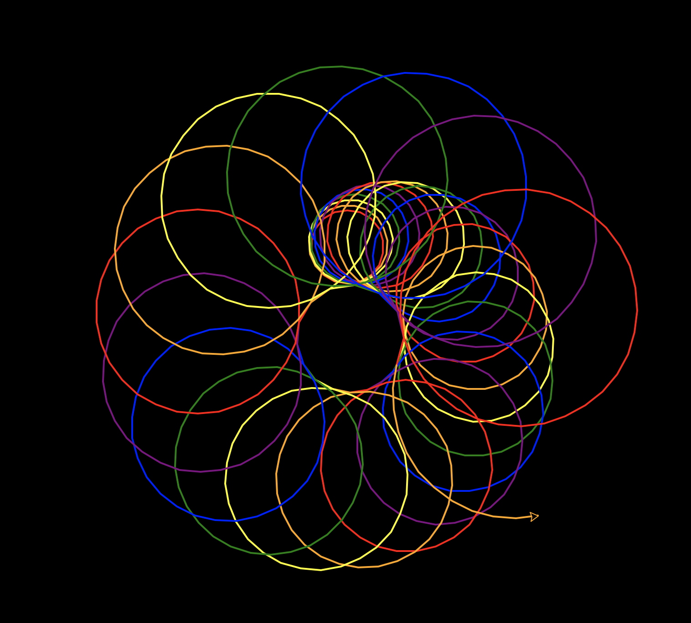
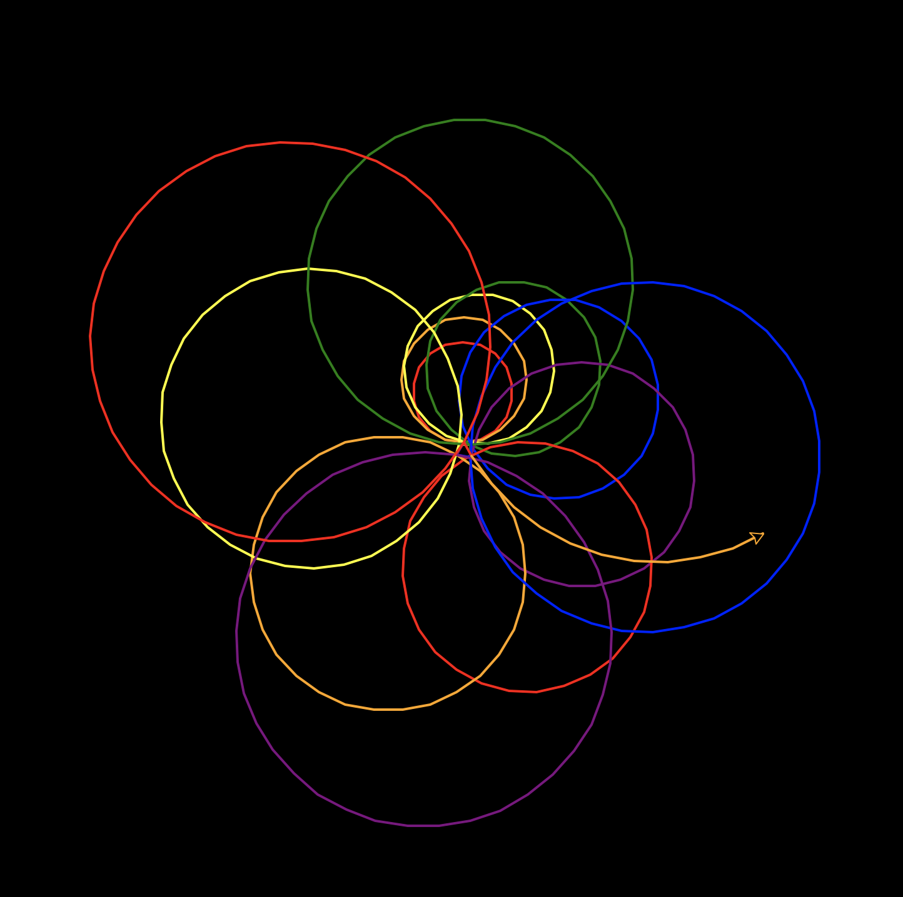

Kaleido-Spirale
===============

So wie einfache Codezeilen ein gutes Programm ergeben, bilden auch einfache Formen ein wunderschönes Bild! Die Kaleido-Spirale kombiniert Farben und Formen und erschafft so Meisterwerke der Digitalkunst, die jeder Kunstgalerie Ehre machen würden!

Die Turtle zeichnet der Reihe nach viele Kreise auf den Bildschirm. Nasch jedem Kreis ändert die Turtle Position, Winkel, Farbe und Grösse des nächsten Kreises, den sie zeichnet. So entsteht mit der Zeit ein tolles Muster.

Prinzip
-------

In diesem Projekt schichtest du mit dem Modul ``turtle`` und einer klugen Schleifenmethode Kreise spiralig übereinander. Immer, wenn ein Kreis gezeichnet wird, erhöht das Programm die Parameter des Codes, der die Kreise zeichnet. Jeder Kreis ist anders als der vorhergehende, sodass das Muster interessanter wird.

.. note:: Funktion ``cycle()`` (Kreislauf)

   Das Programm setzt die Funktion ``cycle()`` aus dem Modul ``itertools`` ein, damit die Spiralen bunt werden. Mit der Funktion ``cycle()`` durchläuft das Programm immer wieder dieselbe Liste von Farben. So kann man ganz leicht für jeden Kreis eine andere Stiftfarbe einsetzen.

Spiralen zeichnen
-----------------

Turtle laden und einrichten
^^^^^^^^^^^^^^^^^^^^^^^^^^^

Dieser Code ruft Funktionen im Modul ``turtle`` auf und legt damit die Hintergrundfarbe ebenso fest wie das Tempo und die Breite der Turtle.

.. code-block:: python

   import turtle as t

   t.bgcolor('black')
   t.speed('fast')
   t.pensize(4)

Nun legst du die Farbe der Turtle-Malspur fest und testest den Code, indem du einen Kreis zeichnest.

.. code-block:: python

   t.pencolor('red)
   t.circle(30)

.. todo:: |exercise| Füge diese Zeilen am Ende des Codes an und führe das Programm aus.

Weitere Kreise
^^^^^^^^^^^^^^

Da wir viele Kreise brauchen, folgt nun der schlaue Plan: Setze die Befehle zum Zeichnen des Kreises in eine Funktion und füge noch eine Zeile dazu, sodass die Funktion sich selbst aufruft. Diesen Trick nennt man *Rekursion*. DIe Funktion wiederholt sich selbst immer und immer wieder.

Da Funktionen vor ihrem Gebrauch definiert werden müssen, musst du die Funktion weit nach oben setzen.

.. todo:: |exercise| Wie weit oben muss die Funktion definiert werden? Finde die Stelle!

Aufregendere Muster erhältst du mit den folgenden Änderungen im Code. Damit wird der Kreis immer grösser und die Farben ändern sich. Der Code enthält die Funktion ``cycle()``, die eine Liste von Werten als Parameter übernimmt und eine spezielle Liste zurückgibt, die du mit der Funktion ``next()`` in einem unendlichen Kreislauf ausführen lassen kanns.

.. code-block:: python

   from itertools import cycle

Probiere es aus! |rocket|

.. |smile| replace:: 😃
.. |exercise| replace:: ✏️
.. |muscle| replace:: 💪
.. |rocket| replace:: 🚀