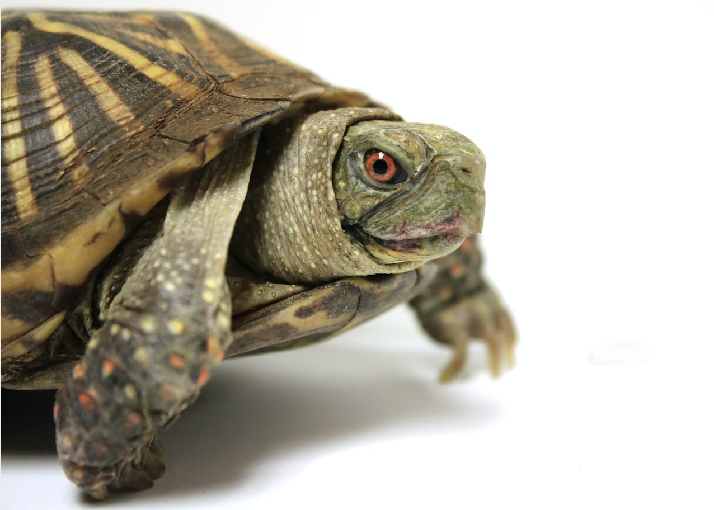

Robot-Zeichner
==============

In Python kann man ganz leicht zeichnen. Mit dem Modul ``turtle`` kannst du eine Schildkröte über den Bildschirm bewegen, die einen Stift hat und damit Bilder zeichnet. In diesem Projekt, programmierst du die Turtle so, dass sie mehr und mehr Bilder von Robotern zeichnet!

Führst du das Programm aus aus, legt die Python-Turtle los und bewegt sich über den Bildschirm. Dabei wird ein Roboter gezeichnet. Du siehst zu, wie der Roboter Stück für Stück in verschiedenen Farben entsteht.

Prinzip
-------

Zuerst schreibst du eine Funktion, die Rechtecke zeichnet. Dann stelsst du die Rechtecke zu einem Roboter zusammen. Ihre Farbe und Grösse kannst du anhand der Parameter ändern, die3 dur der Funktion übergibst. Lange, dünne Rechtecke können also die Beine bilden, quadratische die Augen und so weiter.

.. note:: Mit dem Modul ``turtle`` steuerst du eine Roboterschildkröte, die einen Stift bei sich trägt. Du kannst Turtle sagen, wann sie den Stift aufsetzen und zeichnen soll und wann sie ihn heben soll, sodass sie sich an eine neue Position begeben kann, ohne eine Spur zu hinterlassen.

Die Turtle geht zum Beispiel 100 Pixel vorwärts, dreht sich um 90 Grad und geht 50 Pixel vorwärts mit folgendem Befehl:

.. code-block:: python

   t.forward(100)
   t.left(90)
   t.forward(50)

Rechtecke zeichnen
------------------

.. todo:: |exercise| Lade in deinem neuen Programm das Modul ``turtle`` aus der Bibliothek.

   Tipp: Du kannst dem Modul eine Abkürzung zuordnen, dann musst du den Namen nicht mehr ausschreiben und sparst dir eine Menge Tipparbeit! |smile|

Nun erstellen wir die Funktion, die die Rechtecke für die Roboter zeichnet. Sie hat drei Parameter:

 #. die Länge der horizontalen Seite
 #. die Länge der vertikalen Seite
 #. die Farbe

Du verwendest eine Schleife, die bei jedem Durchlauf eine orizontale und eine vertikale Seite zeichnet, und du lässt sie zweimal laufen.

Der Code lautet:

.. code-block:: python

   def rectangle(horizontal, vertical, color):

       t.pendown()
       t.pensize(1)
       t.color(color)
       t.begin_fill()

       # dieser Block zeichnet das Rechteck
       for counter in range(1, 3):

           t.forward(horizontal)
           t.right(90)
           t.forward(vertical)
           t.right(90)

       t.end_fill()
       t.penup()

       t.speed('slow')

       # Hintergrundfarbe wählen
       t.bgcolor('Dodger blue')

.. note:: Turtle Modus

   .. image:: images/degrees.png
      :align: left
      :width: 200 px

   Du verwendest die Turtle hier im Standard-Modus. Das heisst, die Turtle blickt zuerst zur rechten Bildschirmseite. Setzt du ``heading`` auf 0, startet sie also nach rechts.

   Die Turtle ist normalerweise eine Pfeilspitze. Die folgende Code-Zeile gibt ihr die Form einer Schildkröte:

   .. code-block:: python

      t.shape('turtle')

   Mit dem Befehl ``t.speed()`` legst du fest, wie schnell die Turtle unterwegs ist. Von sehr langsam bis sehr schnell gibt es hier die Werte: 'slowest', 'slow', 'normal', 'fast' und 'fastest'.

Den Roboter zeichnen
--------------------

Nun kannst du den Roboter zeichnen. Er wird Stück für Stück gezeichnet, von den Füssen bis hinauf zum Kopf.

Die Füsse
^^^^^^^^^

Du musst die Turtle an den Punkt bewegen, an dem der erste Fuss gezeichnet werden soll. Dann muss er mit der Rechteck-Funktion gezeichnet werden. Das gleiche musst du für den zweiten Fuss machen.

.. code-block:: python

   # Füsse
   t.goto(-100, -150)
   rectangle(50, 20, 'blue')

   t.goto(-30, -150)
   rectangle(50, 20, 'blue')

Die Beine
^^^^^^^^^

Der nächste Programmabschnitt bewegt die Turtle dorthin, wo sie die Beine zeichnen soll.

.. code-block:: python

   # Beine
   t.goto(-25, -50)
   rectangle(15, 100, 'grey')

   t.goto(-55, -50)
   rectangle(15, 100, 'grey')

Der Oberkörper
^^^^^^^^^^^^^^

.. code-block:: python

   # Rumpf
   t.goto(-90, 100)
   rectangle(100, 150, 'red')

Die Arme
^^^^^^^^

.. code-block:: python

   # Rechter Oberarm und Unterarm
   t.goto(-150, 70)
   rectangle(60, 15, 'grey')

   t.goto(-150, 110)
   rectangle(15, 40, 'grey')

   # Linker Oberarm und Unterarm
   t.goto(10, 70)
   rectangle(60, 15, 'grey')

   t.goto(55, 110)
   rectangle(15, 40, 'grey')

Der Hals
^^^^^^^^

.. code-block:: python

   # Hals
   t.goto(-50, 120)
   rectangle(15, 20, 'grey')

Der Kopf
^^^^^^^^

.. code-block:: python

   # Kopf
   t.goto(-85, 170)
   rectangle(80, 50, 'red')

Die Augen
^^^^^^^^^

Fügen wir noch zwei Augen ein, damit der Roboter sieht, wohin er geht! |smile| Dazu zeichnest du ein grosses, weisses Rechteck mit zwei kleineren Quadraten darin (die Pupillen).

.. code-block:: python

   # Augen
   t.goto(-60, 160)
   rectangle(30, 10, 'white')

   # Pupillen
   t.goto(-55, 155)
   rectangle(5, 5, 'black')
   t.goto(-40, 155)
   rectangle(5, 5, 'black')

Der Mund
^^^^^^^^

Zeichne dem Roboter noch einen Mund.

.. code-block:: python

   # Mund
   t.goto(-65, 135)
   rectangle(40, 5, 'black')

Die Turtle verstecken
---------------------

Nun musst du die Turtle verstecken, sonst sitzt sie mitten im Gesicht des Roboters und das wäre doch seltsam.

.. code-block:: python

   t.hideturtle()

.. |smile| replace:: 😃
.. |exercise| replace:: ✏️
.. |muscle| replace:: 💪
.. |rocket| replace:: 🚀